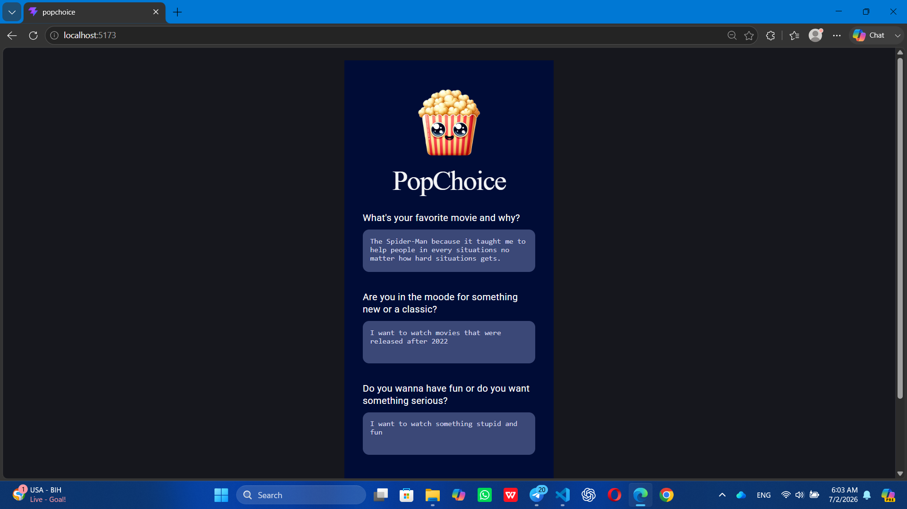
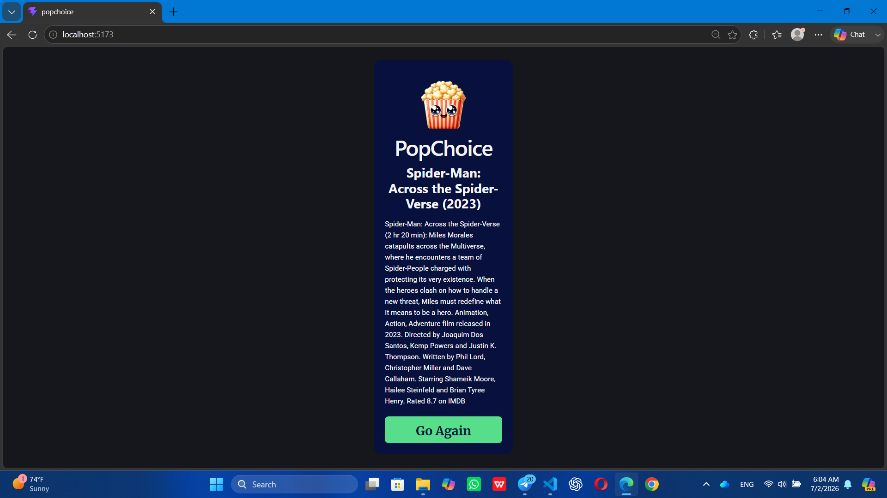

PopChoice – AI Movie Recommendation App
Overview:
PopChoice is an AI-powered movie recommendation web application built with React. Instead of recommending movies using simple keyword matching, PopChoice understands the user’s movie preferences using AI embeddings and semantic vector search.
The application asks users a few questions about their movie preferences, searches a movie database stored in Supabase using vector similarity, and generates a personalized recommendation explanation using OpenRouter AI.

Features:
AI-powered movie recommendations
Semantic search using vector embeddings
Personalized recommendation explanation
Responsive user interface
Loading state while AI processes the request
Reset and recommend another movie

Technologies Used:
React
Vite
JavaScript
OpenRouter API
OpenAI Embeddings (text-embedding-3-small)
GPT OSS 120B (openai/gpt-oss-120b:free)
cloudflare
Supabase
pgvector
CSS

⸻

Project Structure
src
│
├── components
│ ├── QuestionsView.jsx
│ ├── ResultView.jsx
│ └── LoadingState.jsx
│
├── data
│ └── content.js
│
├── lib
│ └── config.js
│
├── utils
│ ├── createEmbedding.js
│ ├── searchMovies.js
│ └── generateExplanation.js
│
├── App.jsx
└── App.css

Installation:
Clone the repository:
git clone <your-github-repository-url>
Go into the project folder:
cd popchoice
Install dependencies:
npm install
Start the development server:
npm run dev

Environment Variables:
Create a .env file in the project root and add:

VITE_OPENROUTER_API_KEY=your_openrouter_api_key

VITE_SUPABASE_URL=your_supabase_url

VITE_SUPABASE_ANON_KEY=your_supabase_anon_key

How It Works
The user answers three movie preference questions.
The answers are combined into a single preference profile.
The profile is converted into an embedding using OpenRouter.
Supabase performs a semantic vector similarity search.
The most relevant movie is returned.
OpenRouter GPT generates a personalized explanation.
The recommended movie is displayed.

Screenshots
Questions View:

Recommendation View:

Reflection
While building this project, I learned how modern AI recommendation systems work by combining embeddings, vector databases, and large language models. So, one challenge I faced was configuring the OpenRouter API and ensuring the embedding generation worked correctly. I also worked through issues with displaying movie information, styling the interface according to the Figma design, and making the application responsive.
Therefore, this project helped me understand Retrieval-Augmented Generation (RAG), semantic search, React state management, asynchronous programming, and integrating external APIs into a real-world application.

Best regards,
Bibi Hawa Abdul Shukoor
